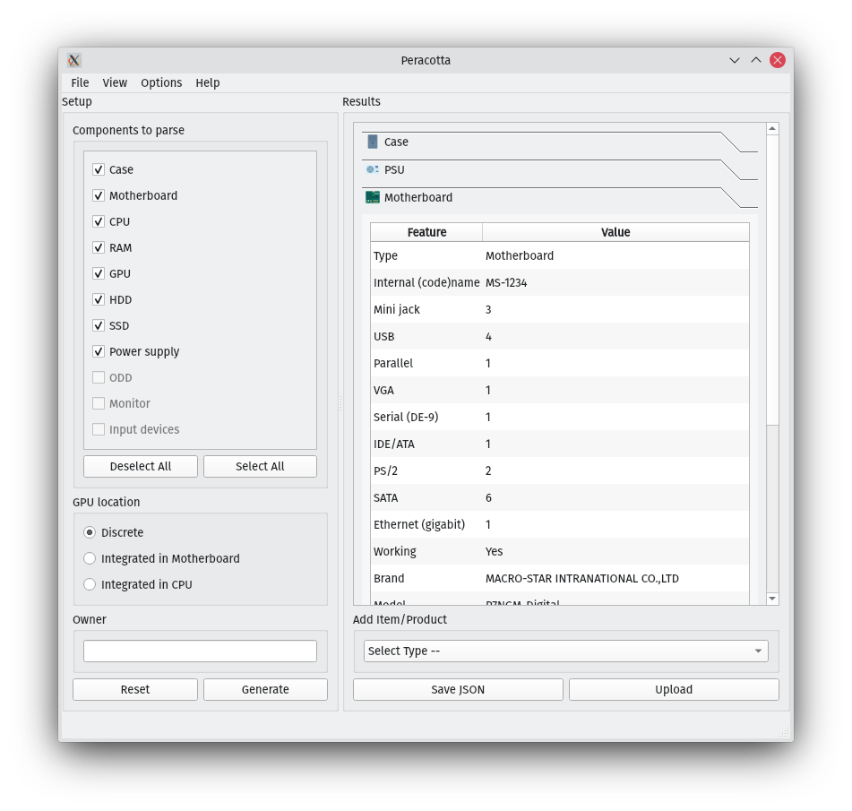

[](https://github.com/WEEE-Open/peracotta/actions/workflows/python-tests.yml)
[](https://github.com/WEEE-Open/peracotta/actions/workflows/docker-image.yml)
[](https://github.com/WEEE-Open/peracotta/actions/workflows/lint.yml)


# 🍐 P.E.R.A.C.O.T.T.A. 🍐

*Progetto Esteso Raccolta Automatica Configurazioni hardware Organizzate Tramite Tarallo Autonomamente*

Program to gather data, display it and update [T.A.R.A.L.L.O.](https://github.com/weee-open/tarallo) automatically.

## Common usage

Multiple use cases are possible. More details on each program are provided in the *How to install and run* section.

### You are using a relatively fast pc

Launch `peracotta`: that is the GUI that allows you to gather data, parse it and display it.



Options can be configured in the left pane, then after Generate is pressed data is displayed in the right pane.  
Some basic editing is possible (add and remove items and features, edit feature values). The result can be saved as a JSON or uploaded directly to tarallo.

### You are using a slow pc or you don't have PyQt installed

Launch `peracruda` from the terminal: this a script that gathers and parses data, however it offers no editing capabilities.  
At the end, you can save data as a JSON or upload it to tarallo directly.

The saved JSON can be uploaded to tarallo or imported from the `peracotta` GUI e.g. on another computer, to review and edit it before upload.

### You are on a pc that barely runs

If you are desperate and the entire system is unstable due to failing hardware or any other reason, run `scripts/generate_files.sh`. That's the most bare-bones way to gather data: the script takes a single (optional) parameter for the output directory, and generates some txt files. No parsing is done.

You can load those files in `peracruda` (`-f` option) or `peracotta` (`File > Load raw files` option) and continue from there.

## How to install and run

```bash
# Clone this repo
git clone https://github.com/weee-open/peracotta

# Make a virtual environment and activate it
cd peracotta
python3 -m venv venv
source venv/bin/activate

# Install the package
pip install .

# Copy the example .env file and edit it to your liking
cp .env.example peracotta/.env
nano .env
```

### Privileges and sudo

generate_files.sh requires root permissions. There are a few ways around this, none of which is terribly secure:

#### Call the script through sudo

This is what is done automatically: both peracruda and peracotta will run `sudo generate_files.sh` where needed.

peracotta will also ask you the sudo password, however keep in mind that is done with a QMessageBox and the password is stored in memory in plaintext. If you don't trust our code, don't type it there.

If you have configured sudo with NOPASSWD, at least for the generate_files.sh script, you can add this to .env:

```bash
export GENERATE_FILES_ASK_SUDO_PASSWORD=0
```

so it will not ask your password anymore but still use sudo.

#### Run the script as root

This is **not recommended**, but you can run everything as root and disable sudo. This is particularly useful if you don not have sudo at all.

Add this to your .env:

```bash
export GENERATE_FILES_USE_SUDO=0
```
#### Manually

Run `sudo generate_files.sh /path/to/output/directory` then load the raw files in peracruda or peracotta. This is probably the safest way, considering that generate_files.sh is pretty short so you can inspect it before running. Everything else will work as usual and won't require root permissions.

### How to develop

Same as before, until the `pip install` part. Just install `requirements-dev.txt` instead:
`pip install -r requirements-dev.txt`  

This will allow you to run tests: `pytest -vv tests`

Some markers are also available, e.g. you can run `pytest -m gui` to just test the gui, or `pytest -m 'not gui'` to test everything else. See `pytest.ini` for a list of markers.

If requirements change:  
- install the correct version of the requirements (e.g. a new library or a new version of an already installed library)  
- with the virtual environment activated, run `pip freeze > requirements-dev.txt` and *manually* edit the file (add the `-r requirements.txt` line and remove non-dev requirements)

If you can't run generate_files.sh because you don't have access to `sudo`, such as on our development VM, you can look at `tests/source_files` for examples.

### peracruda (CLI)

This script basically runs `sudo ./generate_files.sh` and collect data into an appropriate json for T.A.R.A.L.L.O, but it does so in an interactive manner, so you can either pass it the arguments, or it will ask you for them nicely.

You can also pass as the -f/--files argument the directory where generate_files.sh dropped its files.

You can find the usage below, but keep in mind that the three most important arguments are:

- the path for files generation: if none given, it will default to a tmp directory, and if it exists, you will be asked whether you want to overwrite it
- `-g | -c | -b`: one of these tells the script where the GPU (or graphics card if it's not integrated) is located. If none of them is given, a menu with the same choices will appear during the execution.
- `--code CODE` and `--owner OWNER`: these two parameters are used to add some more information directly into the output json file. 
- `-f` to read files from the path instead of calling `generate_files.sh` again.

```
usage: peracruda [-h] [-f] [--code CODE] [--owner OWNER] [-p PARSERS]
                 [-g | -c | -b | --gpu-none] [-v]
                 [path]
Parse the files generated with generate_files.sh and get all the possible info
out of them
positional arguments:
  path                  optional path where generated files are stored
options:
  -h, --help            show this help message and exit
  -f, --files           reuse previously generated files
  --code CODE           set the code assigned by T.A.R.A.L.L.O
  --owner OWNER         set a owner
  -p PARSERS, --parsers PARSERS
                        which parsers to use
  -v, --verbose         print some warning messages
GPU Location:
  -g, --gpu             computer has dedicated GPU
  -c, --cpu             GPU is integrated inside the CPU
  -b, --motherboard     GPU is integrated inside the motherboard
  --gpu-none            There's no GPU at all
```

### peracotta (GUI)

Just need to run it with `./peracotta` or from your file manager. It does everything the terminal based version does and more, all through a GUI.

### generate_files.sh

This will create some txt files with data related to the computer, that will be parsed by launching 
`peracruda` with -f/--files argument. The hard work is powered by the many `read_X.py` scripts, which are the actual 
parsers.

Install dependencies on Debian-based distributions (Debian, Ubuntu, Xubuntu, etc):  
`sudo apt install pciutils i2c-tools mesa-utils smartmontools dmidecode`  
These are the actual programs that generate the files that we parse.

### parsers

There are many read_something.py scripts in the `parsers` directory: these are used internally by the other scripts.
They can also be launched from the command line, with very basic parameters.
They can also be imported as libraries.

### assets

This directory contains some images and other files used by the GUI.<br>
Fan icons created by <a href="https://www.flaticon.com/free-icons/fan" title="fan icons">juicy_fish</a> - Flaticon
<a href="https://www.flaticon.com/free-icons/more" title="more icons">More icons created by Kirill Kazachek - Flaticon</a><br>
Down arrow icons created by <a href="https://www.flaticon.com/free-icons/down-arrow" title="down arrow icons">Freepik - Flaticon</a>
